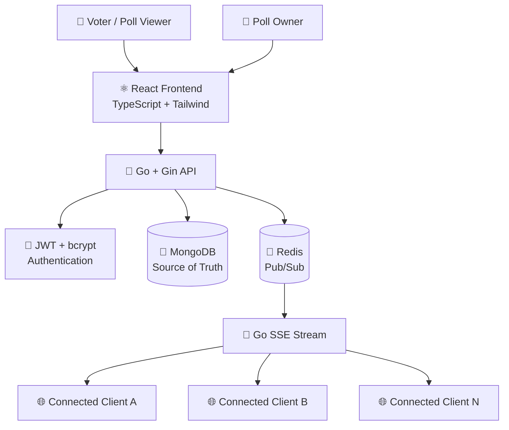
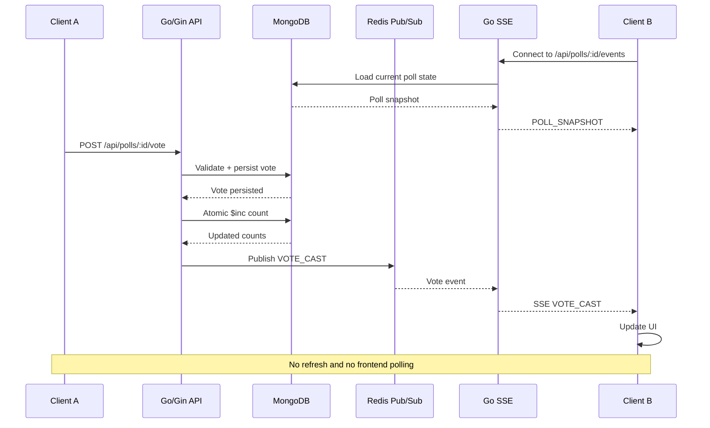
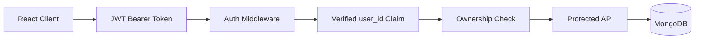

<div align="center">

# Pulse - Live Polling Platform

### Create polls. Share them. Watch votes happen live.

A full-stack real-time polling platform built with **React, Go/Gin, MongoDB, Redis Pub/Sub, and Server-Sent Events (SSE)**.

Build a poll, share it with anyone, collect votes, and watch the results update instantly across connected clients — without refreshing the page.


<br>


</div>

---

## 🚀 Introduction

**Live Polling Platform** is a real-time web application designed for creating, sharing, voting on, and monitoring polls.

The main engineering challenge is not simply storing votes — it is delivering **live vote updates to every connected client without page refreshes or client-side polling**.

The application uses:

- **React** for the interactive frontend
- **Go + Gin** for the backend API
- **MongoDB** as the persistent source of truth
- **Redis Pub/Sub** as the real-time event transport
- **Server-Sent Events (SSE)** to stream events from Go to connected browsers

When a user votes, the event follows this path:

```text
React Client ➞ Go/Gin API ➞ MongoDB ➞ Redis Pub/Sub ➞ Go Realtime Subscriber ➞ SSE ➞ Connected React Clients
```

No page refresh | No fake timers | No frontend polling.

---

## ✨ Features

| Feature | Description |
|---|---|
| 🔐 Authentication | Signup, login, logout and session restoration |
| 🔑 JWT Security | Token-based authentication with server-side validation |
| 🔒 Password Security | Passwords protected using bcrypt |
| 🗳️ Poll Creation | Create polls with dynamic options |
| 👥 Public Voting | Anyone can access a shared poll and vote |
| ⚡ Live Results | Vote counts update instantly without refresh |
| 📡 Redis Pub/Sub | Real vote events are distributed through Redis |
| 📲 SSE Streaming | Browser clients receive live server events |
| 🚫 Duplicate Vote Protection | Database-level unique constraints prevent repeated voting |
| 📊 Live Percentages | Results and percentages update automatically |
| 👤 My Polls | Poll owners can view and manage their polls |
| 🔐 Ownership Control | Only the poll creator can manage their poll |
| ⛔ Poll Closing | Owners can close polls and stop new votes |
| 🗑️ Poll Deletion | Owners can delete their polls |
| 🔎 Search | Search polls by title and description |
| ↕️ Sorting | Sort by newest or most voted |
| 🟢 Connection Status | Connecting, connected, reconnecting and disconnected states |
| ♻️ Reconnection | SSE automatically attempts to reconnect |
| 📱 Responsive UI | Optimized for desktop, tablet and mobile |
| ♿ Accessible UI | Keyboard focus, readable states and accessible interactions |
| 🧪 Automated Testing | Backend unit/integration coverage |
| 🐳 Docker Ready | MongoDB, Redis, backend and frontend container configuration |

---

## 🎯 Core Problem Solved

Traditional polling applications often require clients to repeatedly request the server:

```text
Browser → GET results
Browser → GET results
Browser → GET results
Browser → GET results
```

This application uses an event-driven architecture instead:

```text
User Vote
   ↓
Go API
   ↓
MongoDB
   ↓
Redis Pub/Sub
   ↓
Go Subscriber
   ↓
SSE
   ↓
All Connected Browsers
```

This allows connected users to see the updated result immediately.

---

# 🏗️ Architecture



---

## 🔄 Real-Time Vote Flow



---

# 📡 SSE Lifecycle

The frontend exposes connection states:

```text
🟢 Connected
🟡 Connecting
🟠 Reconnecting
🔴 Disconnected
```

The backend also performs cleanup when the request context is cancelled.

---

# 🔐 Security Architecture



### Security measures

- JWT-based authentication
- bcrypt password hashing
- Server-side token validation
- Server-derived ownership
- Generic invalid-login responses
- Request validation
- Duplicate-vote database constraints
- Closed-poll validation
- No frontend JWT secrets
- No sensitive information in public SSE payloads
- No `dangerouslySetInnerHTML`
- CORS configured through environment variables
- Relative `/api/*` requests
- Graceful Redis cleanup
- Standardized API error responses

---

# 📁 Project Structure

```text
live-polling-platform/
│
├── backend/
│   ├── cmd/
│   │   └── api/
│   │       └── main.go
│   │
│   ├── config/
│   ├── handlers/
│   ├── middleware/
│   ├── models/
│   ├── realtime/
│   ├── repositories/
│   ├── routes/
│   ├── services/
│   ├── tests/
│   │
│   ├── Dockerfile
│   ├── go.mod
│   └── go.sum
│
├── src/
│   ├── components/
│   ├── hooks/
│   ├── lib/
│   ├── services/
│   ├── types.ts
│   ├── App.tsx
│   └── main.tsx
│
├── public/
│
├── images/
│   └── Project Banner.png
│
├── Dockerfile
├── docker-compose.yml
├── nginx.conf
├── package.json
├── tsconfig.json
├── vite.config.ts
├── .env.example
├── .gitignore
└── README.md
```

---

# 🛠️ Tech Stack

## Frontend

   

## Backend

   

## Database & Realtime

  

## Infrastructure

  

---

# 🎨 UI / UX Design

The interface uses an **Obsidian Editorial** visual direction instead of a generic dashboard template.

### Design characteristics

- Deep midnight slate foundation
- Electric cyan realtime accents
- Signal emerald live states
- Crisp editorial typography
- Plus Jakarta Sans for UI and display text
- JetBrains Mono for counters and telemetry
- Smooth progress transitions
- Responsive layouts
- Keyboard-friendly interactions
- Live connection indicators
- Toast-based feedback
- Clear empty and error states

---

## 🖥️ Main Screens

### Landing Page

The landing experience communicates the core product immediately:

```text
Create polls.
Share them.
Watch votes live.
```

It also includes an interactive live-result preview to visually communicate the realtime capability.

---

### Live Results

Results update through SSE:

```text
What should we build next?

React
███████████████████████  58%

Go
███████████████          32%

Rust
█████                    10%

🟢 LIVE
42 participants
```

---

# 📸 Screenshots

> Add your final screenshots inside the `images/` directory and update the filenames below.


<p align="center">
  
</p>

<p align="center">
  
</p>

---

# 🔌 API Overview

## Authentication

| Method | Endpoint | Purpose |
|---|---|---|
| POST | `/api/auth/signup` | Create account |
| POST | `/api/auth/login` | Authenticate user |
| GET | `/api/auth/me` | Get authenticated profile |

---

## Polls

| Method | Endpoint | Purpose |
|---|---|---|
| POST | `/api/polls` | Create poll |
| GET | `/api/polls` | List active polls |
| GET | `/api/polls/:id` | Get poll |
| GET | `/api/polls/mine` | Get owned polls |
| PUT | `/api/polls/:id` | Update poll |
| POST | `/api/polls/:id/close` | Close poll |
| DELETE | `/api/polls/:id` | Delete poll |

---

## Voting

| Method | Endpoint | Purpose |
|---|---|---|
| POST | `/api/polls/:id/vote` | Cast vote |

---

## Realtime

| Method | Endpoint | Purpose |
|---|---|---|
| GET | `/api/polls/:id/events` | SSE realtime stream |
| GET | `/api/polls/:id/stream` | SSE stream alias |

---

## Health

```text
GET /api/health
```

Expected healthy state:

```json
{
  "status": "healthy",
  "services": {
    "mongodb": "connected",
    "redis": "connected"
  }
}
```

The health check also verifies MongoDB and Redis connectivity.

---

# 🧪 Testing

The project was tested at both unit/integration and end-to-end levels.

## Backend

```bash
cd backend
GOTOOLCHAIN=local go test -v -count=1 ./tests
```

Result:

```text
32/32 tests passing
```

---

## Frontend Type Checking

```bash
npm run lint
```

Result:

```text
0 TypeScript errors
```

---

## Production Build

```bash
npm run build
```

Result:

```text
Vite production build successful
```

---

# ✅ Functional Test Matrix

| Test | Expected Result | Status |
|---|---|---|
| Signup | Account created | ✅ |
| Duplicate signup | 409 response | ✅ |
| Valid login | JWT returned | ✅ |
| Wrong password | 401 response | ✅ |
| `/me` with valid token | Profile returned | ✅ |
| `/me` without token | 401 response | ✅ |
| Create poll | Poll persisted | ✅ |
| Fetch poll | Poll returned | ✅ |
| Valid vote | Vote persisted | ✅ |
| Duplicate vote | 409 response | ✅ |
| Invalid option | 400 response | ✅ |
| Nonexistent poll | 404 response | ✅ |
| Closed poll vote | 400 response | ✅ |
| Owner close | Poll closed | ✅ |
| Non-owner close | 403 response | ✅ |
| Owner delete | Poll deleted | ✅ |
| Non-owner delete | 403 response | ✅ |
| SSE snapshot | Initial state received | ✅ |
| SSE live vote | Event received | ✅ |
| Poll isolation | No cross-poll events | ✅ |
| Multiple subscribers | All receive event | ✅ |
| Redis Pub/Sub | Event delivered | ✅ |
| Reconnect | Client retries connection | ✅ |
| MongoDB persistence | Data survives request | ✅ |
| Redis disconnect cleanup | Resources released | ✅ |

---

# ⚡ Realtime Verification

The most important end-to-end scenario was tested using two clients.

### Client A

```text
Open Poll
   ↓
Vote for Option A
```

### Backend

```text
Vote Request
    ↓
Validation
    ↓
MongoDB Vote Insert
    ↓
MongoDB Atomic $inc
    ↓
Redis Publish
```

### Client B

```text
Redis Subscriber
      ↓
Go SSE Handler
      ↓
EventSource
      ↓
Live Result Update
```

### Result

```text
Client A votes
      ↓
MongoDB updated
      ↓
Redis event published
      ↓
Go receives event
      ↓
SSE sends event
      ↓
Client B updates
      ↓
NO PAGE REFRESH
```

---

# 🛡️ Duplicate Vote Protection

Duplicate voting is enforced at the database level.

The application creates a unique constraint using:

```text
poll_id + voter_identifier
```

This means even if multiple requests reach the backend simultaneously, MongoDB remains the final enforcement layer.

The backend also validates:

- Poll existence
- Poll status
- Option ID
- Voter identity
- Authentication state where applicable

---

# 🔄 Failure & Recovery

The application handles several failure scenarios.

### Redis unavailable

MongoDB remains the persistent source of truth.

A vote that has already been successfully persisted is not lost simply because realtime delivery is temporarily unavailable.

---

### SSE disconnect

The frontend detects the connection loss:

```text
CONNECTED
   ↓
DISCONNECTED
   ↓
RECONNECTING
   ↓
CONNECTED
```

The frontend can reconcile the latest poll state after reconnecting.

---

### Malformed Redis event

Realtime subscribers safely handle malformed messages instead of allowing an invalid event to crash the stream.

---

### Poll isolation

Each poll uses its own Redis channel:

```text
poll:A:events
poll:B:events
poll:C:events
```

A vote from Poll A does not update Poll B.

---

# 🐳 Docker

The repository contains Docker configuration for the full stack.

## Services

```text
mongodb
redis
backend
frontend
```

---

## Start

```bash
docker compose up -d --build
```

---

## Check containers

```bash
docker compose ps
```

---

## View logs

```bash
docker compose logs -f backend
```

---

## Stop

```bash
docker compose down
```

---

## Stop and remove volumes

```bash
docker compose down -v
```

> Removing volumes deletes local MongoDB and Redis persisted data.

---

# 🚀 Getting Started

## Prerequisites

Install:

- Node.js 20+
- Go 1.23+
- MongoDB 7+
- Redis 7+
- Git
- Docker Desktop — optional

---

## 1. Clone

```bash
git clone https://github.com/dineshit27/live-polling-hcl-guvi.git cd live-polling-hcl-guvi
cd live-polling-platform
```

---

## 2. Configure Environment

```bash
cp .env.example .env
```

Update the required values.

---

## 3. Start MongoDB & Redis

If using Docker:

```bash
docker compose up -d mongodb redis
```

---

## 4. Start Backend

```bash
cd backend

go mod download

go run ./cmd/api
```

Backend:

```text
http://localhost:8080
```

---

## 5. Start Frontend

From the project root:

```bash
npm install
npm run dev
```

Frontend:

```text
http://localhost:3000
```

---

# 🔍 Health Check

Open:

```text
/api/health
```

or:

```bash
curl http://localhost:3000/api/health
```

The application should report a healthy backend with MongoDB and Redis connected.

---

# 📊 Engineering Metrics

| Metric | Result |
|---|---:|
| Backend tests | 32/32 |
| TypeScript errors | 0 |
| Frontend production build | Passing |
| Redis Pub/Sub | Verified |
| MongoDB persistence | Verified |
| SSE realtime | Verified |
| Duplicate vote protection | Verified |
| Poll isolation | Verified |
| JWT authentication | Verified |
| Ownership authorization | Verified |
| Mobile responsive UI | Verified |
| Docker configuration | Ready |

---

## Redis Pub/Sub for Realtime

Redis is responsible for distributing events between backend realtime subscribers.

This makes the realtime layer independent from the browser.

---

## SSE Instead of WebSockets

Server-Sent Events were selected because the communication pattern is primarily:

```text
Server → Browser
```

The browser sends votes through normal HTTP requests while the server streams updates through SSE.

---

## Atomic Vote Counts

MongoDB `$inc` is used to update option counts atomically.

The vote persistence and count update flow also includes consistency protection to avoid leaving invalid vote state behind.

---

## Server-Side Ownership

The frontend does not decide whether a user owns a poll.

The backend extracts the authenticated identity from the verified JWT and performs the ownership check server-side.

---

# 🤖 AI-Assisted Development

AI tools were used during development as development assistance rather than as a replacement for understanding the architecture.

AI assistance was used for areas such as:

- Boilerplate generation
- Code organization
- UI iteration
- Test generation
- Debugging
- Documentation
- Realtime architecture review
- Security review
- Error handling improvements

The core architecture was intentionally maintained around the required stack:

```text
React
   ↓
Go / Gin
   ↓
MongoDB
   +
Redis Pub/Sub
   ↓
SSE
```

The implementation was manually verified through:

- Backend tests
- Frontend type checking
- Production builds
- Health checks
- Authentication testing
- Voting tests
- Duplicate vote tests
- Ownership tests
- Two-client realtime testing
- Redis channel isolation testing

---

# 📚 Resources

<div align="center">

<a href="https://pulse-live-hclguvi.onrender.com/">
  
</a>

<a href="https://github.com/dineshit27/live-polling-hcl-guvi">
  
</a>

<a href="https://drive.google.com/file/d/1vQTDr39G2J41KYAZDhzsyXyoUF5mG9sK/view?usp=sharing">
  
</a>

</div>

---

# 📄 License

If this repository contains a license file, the project is distributed under the license specified there.

If you intend to use the MIT License, add a `LICENSE` file before changing this section to:

```text
MIT License
```

---

# 👨‍💻 Developer

<div align="center">

## Dinesh M

B.Tech Information Technology  
AI Full Stack Developer • UI/UX & Graphic Designer • Freelancer • Exploring AI & IoT

<a href="https://github.com/dineshit27">
  
</a>

<a href="https://www.linkedin.com/in/m-dinesh-d30/">
  
</a>

<a href="https://m-dinesh-30.web.app/">
  
</a>

<a href="https://peerlist.io/mr_dineshit">
  
</a>

<a href="https://x.com/mr_dinesh_io">
  
</a>

</div>

---

# ⭐ Support

If you found this project useful, consider giving the repository a ⭐.

It helps the project get noticed and encourages further development.

---

<div align="center">

### Built with React, Go, MongoDB, Redis and a lot of debugging.

**Create polls. Share them. Watch votes live.**

<br>

Made with 💙 by **Dinesh M**

</div>
